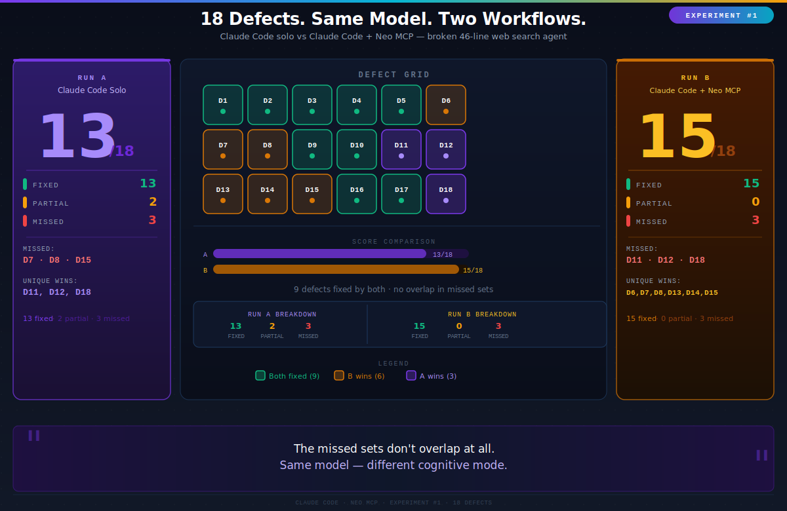
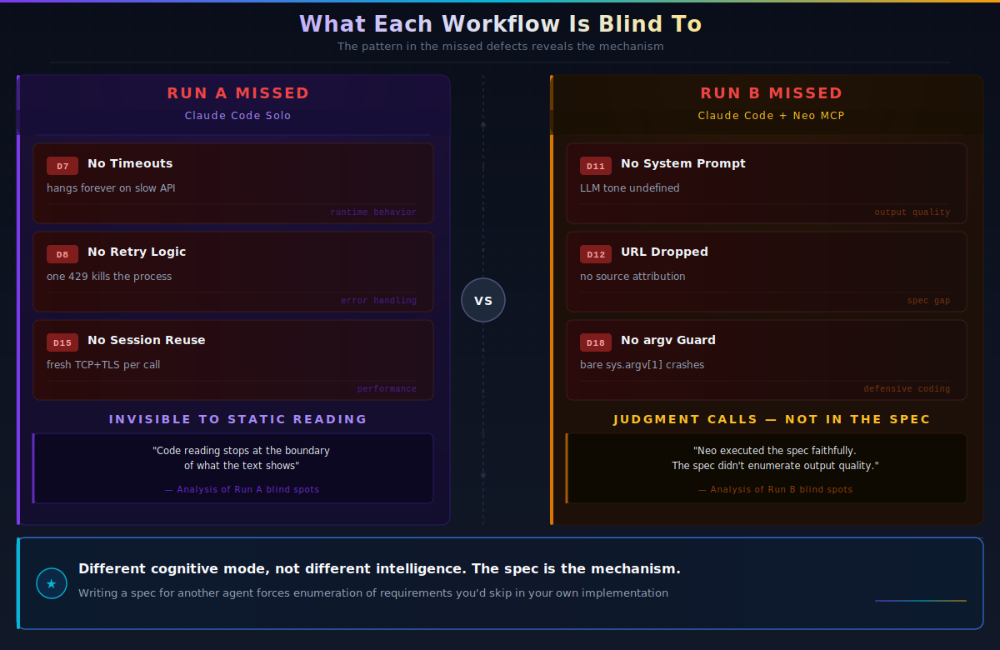

# Same Model, Different Shape: Why Splitting Diagnosis from Execution Fixed More Bugs

*A controlled experiment on a broken web search agent — same prompt, same model, Claude Code solo vs Claude Code + Neo MCP, measurably different results.*

---

This is part of a series of controlled experiments on how workflow structure changes what AI coding agents produce. The question this post asks is narrow: does the *structure* of a workflow change fix quality, even when the underlying model is identical throughout? This is about which bugs get found, which get missed, and why — and the answer points at something specific about how written specs change what an agent is forced to enumerate.

---

## The Patient

`agent_v1.py` is 46 lines. It's meant to take a search query, call SerpAPI, feed the top results into an LLM via OpenRouter, and print an answer. Here's the core of what's actually in there:

```python
SERPAPI_KEY = os.environ["SERPAPI_KEY"]      # KeyError if the var isn't exported

def search(query):
    response = requests.get("https://serpapi.com/search", params={
        "q": query, "api_key": SERPAPI_KEY,
    })
    results = response.json()["organic_results"]   # KeyError on any error body
    return results[:3]                             # hardcoded, never configurable

def summarize(query, results):
    snippets = ""
    for r in results:
        snippets += r["title"] + ": " + r["snippet"] + " "   # URL dropped, string concat
    response = requests.post("https://openrouter.ai/api/v1/chat/completions", ...)
    return response.json()["choices"][0]["message"]["content"] # no guards
```

No `.env` loading. No timeouts. No retry. No cache. No error handling anywhere. Run it without arguments: `IndexError`. Hit a 429: process dies. Leave it on a slow connection: hangs forever.

I catalogued 18 defects across six categories — correctness crashes, missing error handling, reliability gaps, performance, code quality, configurability — and used that inventory as the scoring rubric for both runs.

---

## The Experiment

Both runs got exactly the same human prompt: *this web search agent is broken, diagnose and fix it.*

**Run A — Claude Code solo.** One agent, one pass. Claude Code read the baseline, identified what was wrong, refactored the 46-line script into a proper module tree (`src/search/`, `src/llm/`, `src/agent/`), and shipped 9 new files. No intermediate plan artifact. Diagnosis and execution were one continuous act.

**Run B — Claude Code orchestrating Neo MCP.** A different workflow shape entirely. Claude Code first analyzed the broken script and produced a written defect specification. That spec was dispatched to Neo via MCP. Neo then wrote `neomcp/plans/plan.md` — 17 ordered subtasks, a 7-point pass/fail checklist — and executed against it systematically across 20 files.

The plan's "Research Summary" section captures what happened from Neo's perspective:

> *"All bug descriptions and required fixes were provided by the user in the task spec. No external research needed — the fixes are well-specified architectural improvements."*

"User" here means Claude Code acting as orchestrator. The human gave a vague prompt to both runs. The difference is that Run B's pipeline inserted an explicit phase where the diagnosis produced a deliverable — a written spec — before a line of production code was touched.

---

## The Scoreboard



| Defect | Category | Run A | Run B |
|--------|----------|-------|-------|
| D1 KeyError on env vars | Correctness | Fixed | Fixed |
| D2 load_dotenv never called | Correctness | Fixed | Fixed |
| D3 No raise_for_status (search) | Error handling | Fixed | Fixed |
| D4 Unsafe organic_results access | Error handling | Fixed | Fixed |
| D5 No raise_for_status (LLM) | Error handling | Fixed | Fixed |
| D6 Unsafe choices/message access | Error handling | **Missed** | Fixed |
| D7 No timeouts | Reliability | **Missed** | Fixed |
| D8 No retry logic | Reliability | **Missed** | Fixed |
| D9 No caching | Performance | Fixed | Fixed |
| D10 String concatenation | Quality | Fixed | Fixed |
| D11 No system prompt | Quality | Fixed | **Missed** |
| D12 URL dropped from context | Quality | Fixed | **Missed** |
| D13 Result limit hardcoded | Config | Partial | Fixed |
| D14 Model hardcoded | Config | Partial | Fixed |
| D15 No requests.Session | Performance | **Missed** | Fixed |
| D16 Missing engine param | Correctness | Fixed | Fixed |
| D17 No missing-field guard | Error handling | Fixed | Fixed |
| D18 No CLI arg validation | UX | Fixed | **Missed** |

**Run A: 13 fixed, 2 partial, 3 missed.**
**Run B: 15 fixed, 0 partial, 3 missed.**

The missed sets don't overlap at all.

---

## The Pattern in What Each Missed



This is the part worth dwelling on.

**Run A missed D7, D8, and D15.** Look at exactly what those are:

- **D7** — no `timeout=` on either HTTP call. The baseline hangs forever on a slow API.
- **D8** — no retry logic. A single 429 or connection reset kills the process.
- **D15** — no `requests.Session`. Every call opens a fresh TCP+TLS connection.

These three defects have one thing in common: **they are invisible to static code reading.** Nothing in the source file tells you that a call without a timeout will block. You learn that by running the code under load, by being paged, or by reading API documentation for rate-limit behavior. Code-reading diagnosis stops at the boundary of what the text can show you.

> *Solo Claude Code fixed exactly the defects visible by reading the source. It missed every defect that only becomes visible at runtime.*

**Run B missed D11, D12, and D18.** These are different in kind:

- **D11** — no system prompt. The baseline sends only a user-role message; LLM output tone and format are undefined.
- **D12** — URL/link field dropped. The LLM's context has no source attribution.
- **D18** — bare `sys.argv[1]` with no argument count check. Invoke with no arguments: `IndexError`.

These aren't spec omissions — they're *judgment calls*. D11 and D12 require looking at the prompt structure and deciding it's insufficient, not just incorrect. Run A added a system prompt (`"You are a helpful assistant that answers questions concisely based on provided web search results."`) and source URLs (`Source: {r['url']}`) because it looked at the code with fresh eyes and decided the output quality should be better. Neo executed the spec Claude Code emitted, and the spec didn't enumerate output quality as a concern.

I want to be direct about this: **solo's wins on D11 and D12 are genuine diagnostic creativity.** They should not be hand-waved away because the orchestrated run scored higher overall.

---

## The Sharpest Version of the Finding

Here's the part I keep coming back to.

The model was the same in both runs. Claude Code solo and Claude Code as orchestrator are running the same underlying model. And yet: Claude Code solo missed D7, D8, and D15 when doing the work itself — and then Claude Code as orchestrator put all three explicitly in the spec it wrote for Neo.

Writing a spec for someone else forces you to enumerate requirements you'd otherwise skip over in your own implementation. When you're doing the work yourself, you can stop when the visible bugs are gone. When you're writing instructions for another agent, you have to be explicit about what "done" means — and that act of articulation surfaces the runtime-behavior requirements that code reading alone doesn't reach.

> *Different cognitive mode, not different intelligence. The spec is the mechanism.*

---

## The Two Bugs the Orchestrated Run Shipped

Broader coverage is not the same as correct execution. Run B shipped two bugs worth naming clearly.

**Bug 1: retry logic that doesn't retry rate limits.**

```python
# neomcp/src/search/client.py
@retry(
    stop=stop_after_attempt(3),
    wait=wait_exponential(multiplier=1, min=2, max=10),
    retry=retry_if_exception_type((requests.ConnectionError, requests.Timeout))
)
def search(self, query):
    ...
    if _is_retryable_response(response):   # returns True for 429 and 5xx
        response.raise_for_status()        # raises requests.HTTPError
```

The `@retry` decorator catches `ConnectionError` and `Timeout`. But `raise_for_status()` on a 429 raises `requests.HTTPError` — which is not in the `retry_if_exception_type` list. So when you actually hit a rate limit, the exception propagates immediately. Three attempts are never made.

This is false protection. The code looks like it handles rate limits. It doesn't. And neither run has a test that proves it works, because neither run hit a live 429.

**Bug 2: `get_all()` returns the live cache.**

```python
# Run A — claudecode/src/agent/memory.py
def get_all():
    return dict(_cache)    # safe copy

# Run B — neomcp/src/agent/memory.py
def get_all():
    return _cache          # live dict — mutation corrupts the cache
```

Not catastrophic for a simple CLI. But the moment this module is reused in any context that mutates the return value, the cache is corrupted. Run A made the defensive choice without being asked. Run B didn't.

Both bugs share the same root: the execution was never verified against live failure behavior. Systematic spec coverage does not substitute for runtime verification. That's the cost side of the ledger.

---

## What the Workflow Structure Actually Did

Run A performed diagnosis and execution as one continuous act. The output is bounded by what one reactive pass through the code can surface: static correctness, key-access safety, prompt structure, argument handling — all textually visible defects.

Run B structured the work differently:

```
human prompt
    → Claude Code (analysis) → written defect spec
    → Neo (planning) → plan.md, 17 subtasks, 7-point checklist
    → Neo (execution) → 20-file implementation
```

The spec is where the coverage difference was created. Neo's plan.md records the received requirements at lines 16-17: "Use `requests.Session` with 10s timeout, add tenacity retry" — the surviving trace of what the orchestrator's spec contained; the spec itself was not preserved as a separate artifact. Once written into the plan, D7, D8, and D15 became obligatory line items Neo was required to check off. They got captured not because Neo is smarter, but because the act of writing a spec forces explicit enumeration. You can't write "add retry logic" without committing to what retry logic means.

> *Orchestration's value is not a smarter model. It's that the workflow converts a vague task into spec → plan → execution — and that structure has measurably different coverage characteristics than a single reactive pass.*

The cost is rigidity. Items not in the spec don't get addressed. System prompt quality, URL attribution, CLI defensiveness — all judgment calls that fell through the gap because they weren't written down.

---

## The Missing Step

Neither run measured anything before changing it. The benchmark harness is written (`benchmark.py`) and dry-validates cleanly against all three paths, but it was not run — API keys are required and no numbers are fabricated here. Whether connection pooling and timeouts materially change latency in this agent's workload is an open question.

More importantly: neither run tested against live failure conditions. The 429 retry bug exists because no test hit a real rate-limited API. The mutable cache bug exists because no test called `get_all()` and then mutated what came back.

The workflow that would close both gaps: orchestrated pass for systematic spec coverage, then an adversarial verification pass against live failure behavior. The first phase is what Run B demonstrates. The second phase is what neither run ran.

---

## The Ideal Loop

A solo diagnostic pass produces genuine insight — D11, D12, D18 — that spec-following missed. An orchestrated pipeline with a written spec ensures runtime requirements get enumerated and implemented. Neither is complete without a verification pass that actually exercises the failure paths.

Solo for diagnosis and qualitative judgment. Orchestrated for systematic coverage. Then a verification agent that tries to break what was built.

The next experiment in this series: re-running the orchestrated workflow with a production-grade spec to test whether richer upfront specifications close the judgment-call gap that this run exposed.

---

*All numbers, defect IDs, code snippets, and quotes in this post are drawn directly from `REPORT.md` in this repository. The benchmark harness exists at `benchmark.py` and has been dry-validated but not executed against live APIs. No cost claims are made.*
